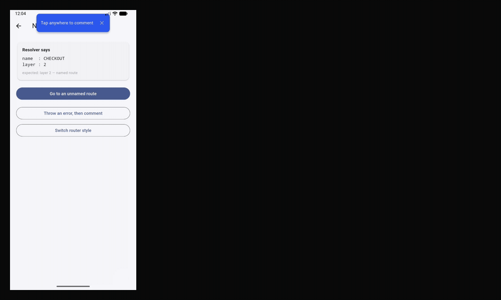

# guidester

In-app tester feedback for Flutter, self-hosted. Testers tap anywhere on any screen, type,
and send; the comment lands on your dashboard with a screenshot, the screen name, the
device, the build, and the errors the app threw.



[](https://pub.dev/packages/guidester)
[](https://github.com/Saurabh-7973/guidester/actions/workflows/ci.yml)
[](https://saurabh-7973.github.io/guidester/)

**Get started:** the [Quick start](packages/guidester/README.md#quick-start) takes about 15
minutes: one command sets up your backend, then two changes to your app.

## What is in this repository

```
packages/guidester/   the Flutter SDK, published on pub.dev as guidester
apps/dashboard/       the web dashboard your team reads comments on
supabase/
├─ setup.sh           sets up your own backend in one command
├─ migrations/        schema, row-level security, private screenshot bucket
├─ functions/ingest/  the only write path: a Deno edge function
└─ tests/             local verification, no Docker or account needed
```

Everything runs on **your** Supabase project. There is no Guidester server, and nothing
you or your testers send leaves your project.

## Security model

The SDK never talks to the database. It has no credentials that can reach it.

- **No RLS policy grants the `anon` role anything** on `projects` or `comments`. Verified
  by test, not by inspection.
- Every write goes through the `ingest` edge function under the service-role key, which is
  read from the environment and appears in no file in this repository.
- Screenshots live in a **private** bucket. Reads are scoped by project folder and served
  via signed URLs.
- Owners see only their own projects, comments, and screenshots — enforced in both
  directions.

## Verify it locally

Requires PostgreSQL 17 (`brew install postgresql@17`). No Docker, no network, no Supabase
account.

```bash
./supabase/tests/run.sh          # schema + RLS, needs PostgreSQL 17
./supabase/tests/ingest_test.sh  # edge function validation paths, needs Deno
```

Spins up a throwaway cluster, installs a minimal stand-in for the Supabase-managed
`auth`/`storage` objects, applies the migration **unmodified**, and runs 22 behavioural
assertions covering tenant isolation, anon lockout, storage folder scoping, the body-length
check, enum rejection, defaults and cascade delete. The assertions run with Supabase's
default table grants applied, so RLS is the only thing standing.

The suite is mutation-tested: granting `anon` read access, making the bucket public, or
removing the project-folder scope each fail the specific assertion that should catch them.

## Deploy

Self-hosted only; there is no hosted service. Create an empty Supabase
project, run `supabase login`, then:

```bash
./supabase/setup.sh --project-ref <PROJECT_REF>
```

It links the project, applies every migration, deploys the ingest function
(with `--no-verify-jwt`, which is mandatory: the SDK carries a project key, not a
Supabase session), checks the function answers, builds the dashboard against the
project, and prints the endpoint and the remaining steps. `--dry-run` shows the
commands; [the self-hosting guide](packages/guidester/doc/self-hosting.md) has
the manual route.

Then open the dashboard, sign up, and create a project: its key is in Settings.
The script makes no account and no key on your behalf.

Keys live in `project_keys` since migration 0006, one row per key, each
labelled and independently revocable. Every project gets one from a trigger, so
there is no such thing as a project you cannot report into. `projects.api_key`
is the pre-0006 column and is no longer read by anything.

Smoke test:

```bash
curl -X POST '<SUPABASE_URL>/functions/v1/ingest' \
  -H 'content-type: application/json' \
  -d '{"api_key":"<API_KEY>","body":"hello from curl","screen_name":"CURL"}'
```

Expected: `{"ok":true}`. A wrong key returns 401; a missing `body` returns 400.

## Known limitations

- **`0001_init.sql` is not idempotent.** A second apply fails on `relation "projects"
  already exists`. A partially failed `db push` cannot simply be re-run.
- The local test suite validates against a *stand-in* for the Supabase schema, not the real
  one. It rules out syntax errors, type errors, broken constraints and a broken security
  model. It is not a substitute for `supabase db push` succeeding.
- `jsr:@supabase/supabase-js@2` is a floating major range, not a pin. The deployed
  function's client version will drift over time.
- **The API key is extractable from a shipped APK.** Anyone holding it can post to your
  project, up to the per-key limits (migration 0012): 30 comments, 120 launches and 60
  verdicts a minute, answered with `429 rate_limited` and `Retry-After`. That bounds a
  flood; it does not stop one. Rotate a key that leaks. Requests with an invalid key are
  not counted, and the limiter fails open if it cannot be reached.
- The offline queue keeps at most 20 comments for 14 days, and needs migration 0011
  on the backend to store a retried comment once.
- **An error message can quote your app's own data.** The SDK sends the last
  three exceptions of the session with a comment, and nothing redacts what an
  exception chose to print. See [PRIVACY.md](PRIVACY.md).
- Errors are caught from `FlutterError.onError` and
  `PlatformDispatcher.onError`. An exception your own code catches and
  swallows is not one of them, and neither is one thrown in a zone the SDK
  never sees.
- **Test builds only.** Screenshots from production capture other people's personal data.
  Production support needs a redaction widget that does not exist yet.

## Licence

MIT. See [LICENSE](LICENSE).
